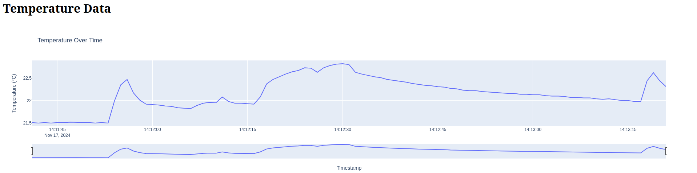

# BME280 driver

## Instructions

Scan the i2c bus to know the address of the devices connected to it. 
```bash
sudo i2cdetect -y 1
```

### Build

```bash
g++ -o cpp_driver bme280_cpp_driver.cpp
```

### Start

Start the C++ i2c driver
```bash
./cpp_driver
```

Start the python main file:
```bash
python3 main.py
```

Start the flask app:
```bash
python3 flask_web_app.py
```

### Run and stop all scripts at the same time

To start all scripts at once:
```bash
./start.sh
```

Find PID of start.sh:
```bash
ps -a
```

To kill all child processes at once:
```bash
pkill -p < start_script_pid >
```

## Improvements
- Turn off sensor in between measurements?
- Measure power consumption?
- Error handling (sensor now found ...)
- Formatting (clang...)
- CMake instead of g++
- Memory management/handling
- C++ version, separate data registers and calibration registers
- Pi mini with ubuntu server?
- Add humidity and pressure
- Add tests
- Handle UTC time in database
- Add logging and remove print statements
- Add diagram

## Result example

